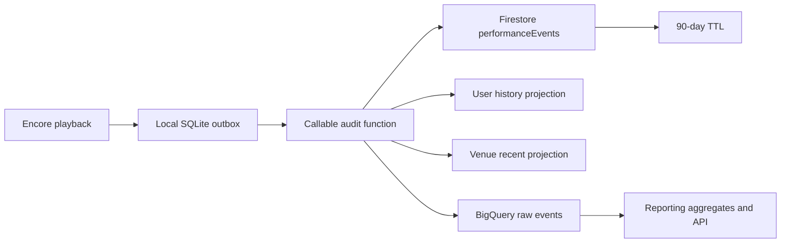

# Audit System V2 Plan

## Implementation Status

### Completed Foundation (2026-08-18)

- Added and deployed the Node.js 22 callable function `recordPerformanceEventV2` in `us-central1`.
- Added canonical schema validation and qualification enforcement.
- Added client UUID idempotency with conflicting-payload rejection.
- Added venue-operator authorization through `user-venue-lookup`.
- Added authoritative venue enrichment and configurable karaoke-night calculation.
- Added transactional writes for the canonical event, venue recent feed, user history, and venue member summary.
- Added `bigQueryStatus=pending`; `expireAt` remains null until confirmed delivery so Firestore TTL cannot remove an unexported event.
- Added focused Node tests for validation, qualification, identity, retry hashing, timezone boundaries, and venue snapshots.

### Next Implementation Slice

- Add the Encore SQLite outbox and callable client.
- Send V2 events in parallel with the legacy audit path during reconciliation.
- Provision BigQuery delivery and set `bigQueryDeliveredAt`/`expireAt` only after successful export.

## Goals

The new audit system must:

1. Record every qualified singer/song performance with venue, song, singer, source, platform, device, time, and location context.
2. Support Top Songs, Top Singers, Top Venues, Busiest Nights, and Busiest Times reporting for venue, company, city, subdivision, country, and global scopes over arbitrary date ranges.
3. Provide users with their previous songs across all venues.
4. Provide TAGG with recent performances at a venue.
5. Provide TAGG with a user's cross-venue history, subject to access rules.
6. Retain data safely without unbounded Firestore growth or destructive client-side archival.

## Confirmed Product Decisions

- A performance qualifies after 30 seconds of playback or natural completion.
- Qualified partial plays count equally, but actual duration and completion reason are retained.
- Source, platform, and opaque device ID are separate fields.
- Guest singers receive a stable venue-scoped singer ID.
- Venue geography is snapshotted on each performance.
- Users and authorized hosts may view cross-venue user history; hosts require a current-venue relationship with the user.
- The venue feed shows stage name, song, artist, and time.
- Firestore is the operational store; BigQuery is the analytics and long-term reporting store.
- Design target is 100-1,000 venues and several million performances per year.
- Venue users see venue reports; company administrators see company rollups; platform administrators see regional/global reports.
- A karaoke night uses the venue timezone and a configurable cutoff, defaulting to 5:00 AM.
- Analytics should update within 5-15 minutes.
- Raw operational events remain in Firestore for 90 days.
- Raw BigQuery events remain for seven years.
- TAGG shows the most recent 100 history entries with pagination and date/search filters.
- Account deletion anonymizes identity while retaining aggregate reporting facts.
- Regional singer rankings include registered users only; guests rank only within their venue.
- Top Venues are ranked separately by performances and unique singers.
- Top Singers are ranked separately by performances and active nights.
- Busiest Nights are ranked separately by performances and unique singers.
- Busiest Times use 30-minute local-time buckets.
- Encore uses a durable local outbox and retries across application restarts.
- A backend callable function validates and writes canonical events.
- Clients generate and reuse an event UUID across retries.
- Geographic reporting uses city, subdivision code/name, and country code/name.
- BigQuery resources use the Firebase project's existing data region.

## Target Architecture



## Canonical Performance Event

Store one immutable event at:

```text
performanceEvents/{eventId}
```

Required fields:

```text
eventId
schemaVersion
qualified

venueId
venueName
companyId
venueTimezone
nightCutoffHour
nightKey
city
subdivisionCode
subdivisionName
countryCode
countryName

songId
songName
artist
songVersion
songDurationMs
actualPlayedDurationMs
completionReason

userId                 // registered TAGG user; nullable
guestSingerId           // stable within venue; nullable
singerStageName

source                  // encore | mobile | unknown
platform                // ios | android | macos | windows | unknown
deviceId                // opaque/pseudonymous
encoreInstallationId
kjId

clientStartedAt
clientEndedAt
serverRecordedAt
expireAt
bigQueryDeliveredAt
```

### Identity Rules

- Registered singers use Firebase Auth UID as `userId`.
- Guests use a stable `guestSingerId` scoped to the venue.
- Stage name is stored as a historical display snapshot.
- Guest identities are never merged across venues by stage name.
- Regional singer rankings include registered users only.

### Night Key

The backend calculates `nightKey` using:

1. The venue's authoritative timezone.
2. The venue's configured cutoff hour, default 5:00 AM.
3. Events before the cutoff belong to the previous calendar date.

Example: Friday 8:00 PM through Saturday 1:00 AM all use Friday's `nightKey`.

## Write Flow

1. Encore detects that playback qualifies.
2. Encore creates a UUID and complete pending event.
3. Encore commits the event into a local SQLite outbox before network delivery.
4. The outbox worker calls an authenticated Firebase callable/HTTPS function.
5. The backend validates authentication, venue access, event schema, and UUID.
6. The backend loads authoritative venue/company/geographic data.
7. The backend calculates `nightKey` and server timestamps.
8. The backend atomically writes the canonical event and required Firestore projections.
9. The event is delivered to BigQuery.
10. Encore removes the outbox row only after backend acknowledgement.
11. Failed delivery retries with the same UUID until acknowledged.

The backend must treat an existing identical `eventId` as success. A conflicting payload using an existing UUID must be rejected and logged.

## Firestore Projections

Keep recent/query-oriented operational views only:

```text
performanceEvents/{eventId}
users/{userId}/performanceHistory/{eventId}
venues/{venueId}/recentPerformances/{eventId}
venues/{venueId}/members/{singerId}
```

Do not store performance history in arrays.

### User History

- Recent 100 performances by default.
- Cursor pagination.
- Date and text filters.
- Cross-venue history is visible to the user.
- A host may view cross-venue history only if the user has performed at the host's current venue.

### Venue Feed

Expose only:

- Stage name
- Song name
- Artist
- Performance timestamp

Do not expose profile IDs, guest IDs, device IDs, or KJ IDs in the venue feed.

## BigQuery

Create a partitioned raw table:

```text
analytics.performance_events
```

- Partition by server event date.
- Cluster by `venueId`, `companyId`, `countryCode`, `subdivisionCode`, and `userId`.
- Seven-year table/partition expiration.
- Use the Firebase project's existing region.
- Delivery target: within 5-15 minutes.

### Aggregate Tables or Materialized Views

Provide:

- Top songs by qualified performances
- Top singers by qualified performances
- Top singers by active karaoke nights
- Top venues by qualified performances
- Top venues by unique singers
- Busiest nights by qualified performances
- Busiest nights by unique singers
- Busiest 30-minute local-time periods
- Source breakdown
- Platform breakdown
- Venue, company, city, subdivision, country, and global rollups

Every aggregate must support day, week, month, year, and arbitrary date ranges where practical.

## Retention and Archival

- Firestore canonical events and projections use a 90-day TTL.
- TTL must not begin until successful BigQuery delivery is recorded.
- BigQuery retains raw events for seven years.
- BigQuery is the reporting archive; do not copy Firestore documents into another Firestore archive collection.
- Ending a karaoke session must not delete queue/request data as part of analytics retention.
- Remove the destructive client-side nightly copy-and-delete archive process after migration.
- Backend monitoring must alert on BigQuery delivery backlog and Firestore events approaching TTL without delivery confirmation.

## Privacy and Security

- Account deletion anonymizes `userId`, device ID, and profile linkage while preserving non-identifying event facts.
- Device IDs must be pseudonymous and rotated where practical.
- Venue feeds expose stage name only.
- Clients must not write canonical events directly to Firestore after migration.
- Callable functions enforce venue and role authorization.
- Firestore rules should return to least privilege after Encore and TAGG use backend APIs.
- Company administrators may access only venues belonging to their company.
- Platform administrators may access regional and global reports.

## Migration Plan

### Phase 1: Schema and Infrastructure

1. Freeze the canonical event schema and metric definitions.
2. Record schema decisions and versioning rules.
3. Provision the callable ingestion function.
4. Provision Firestore collections and indexes.
5. Provision BigQuery raw and aggregate datasets in the project region.
6. Add structured backend logs and delivery metrics.

### Phase 2: Reliable Encore Delivery

1. Add the local SQLite audit outbox.
2. Generate UUIDs when performances qualify.
3. Persist events before attempting network delivery.
4. Add exponential retry with jitter and restart recovery.
5. Add an outbox health/status indicator for operators.

### Phase 3: History APIs

1. Add paginated user-history API.
2. Add paginated venue-feed API.
3. Enforce host/user relationship checks.
4. Update TAGG to use the APIs.

### Phase 4: Encore Charts Migration

Migrate the complete Encore Charts section from direct Firestore collection scans to versioned reporting APIs backed by BigQuery aggregates.

#### Reporting API Contract

1. Add a versioned endpoint such as `analyticsReportV2`.
2. Accept:
    - Report scope: venue, company, city, subdivision, country, or global.
    - Scope identifier where applicable.
    - Start and end date.
    - Venue timezone or authoritative scope timezone behavior.
    - Optional comparison period.
    - Pagination cursor and row limit for ranked tables.
3. Return:
    - Schema/API version.
    - Effective scope and date range.
    - Data freshness timestamp.
    - Whether results include legacy/backfilled records.
    - Metric totals and chart-ready time series.
    - Pagination cursors for ranked tables.
4. Enforce venue, company, and platform-admin permissions on the backend.
5. Return explicit partial-data or pipeline-delay states rather than silently showing incomplete results.

#### Charts and Tables

Replace the current Charts data source for:

- Singers per Karaoke Night line graph.
- Top Songs table and chart.
- Top Singers by qualified songs.
- Top Singers by active karaoke nights.
- Top Venues by qualified songs.
- Top Venues by unique singers.
- Busiest Nights by qualified songs.
- Busiest Nights by unique singers.
- Busiest Times using 30-minute local-time buckets.
- Source breakdown: Encore, mobile, unknown.
- Platform breakdown: iOS, Android, macOS, Windows, unknown.
- Daily, weekly, monthly, yearly, and custom-range summaries.

The night graph must use backend-provided `nightKey` values. Encore must not independently regroup timestamps or recalculate the 5:00 AM boundary.

#### Scope and Date Controls

1. Preserve existing date presets and custom date range selection.
2. Add role-aware scope selectors:
    - Venue users: authorized venues only.
    - Company administrators: company total or individual company venues.
    - Platform administrators: venue, company, city, subdivision, country, and global.
3. Display the timezone and night-cutoff rule used for the report.
4. Provide an optional previous-period comparison for totals and trends.

#### UI Behavior

1. Show loading, empty, stale, partial, permission-denied, and failed states distinctly.
2. Display the reporting freshness timestamp.
3. Paginate ranked tables rather than loading a fixed maximum.
4. Prevent overlapping X-axis labels for long date ranges through adaptive label density.
5. Preserve stable chart dimensions while loading or switching scopes.
6. Cache the last successful report per scope/range for temporary offline viewing, clearly marked as cached.

#### Export

Replace the current partial JSON export with exports generated from the same reporting response. Include:

- Effective scope and date range.
- Data freshness and schema version.
- Nightly and weekly statistics.
- All ranking tables.
- Source and platform breakdowns.
- Busiest-time buckets.
- Legacy-data warnings.

Support JSON initially and add CSV for tabular reports.

#### Parallel Reconciliation

1. Run legacy Charts queries and V2 reporting APIs in parallel during rollout.
2. Add a developer-only reconciliation view or structured log comparing:
    - Total qualified performances.
    - Unique singers.
    - Number of karaoke nights.
    - Top songs.
    - Top singers.
3. Define acceptable variance only for documented legacy data gaps.
4. Block full cutover if current V2 events do not reconcile exactly.
5. Record the final reconciliation results by venue and date range.

#### Legacy Charts Retirement

After reconciliation:

1. Remove `AnalyticsService` direct reads of live and archived Firestore audit collections.
2. Remove client-side night grouping, source inference, and device-platform inference.
3. Remove fixed 5,000-document reporting limits.
4. Remove legacy archive-session dependency from Charts.
5. Keep a temporary feature flag to return to legacy reporting during the initial rollout window.
6. Remove the feature flag after the agreed stability period.

### Phase 5: Parallel Validation

1. Run the legacy and V2 systems in parallel for at least two weeks.
2. Compare performance counts by venue, singer, song, night, and source.
3. Investigate every mismatch.
4. Validate midnight crossover and venue timezone behavior.
5. Validate offline delivery and duplicate retries.

### Phase 6: Legacy Migration

1. Backfill usable legacy audit records into BigQuery.
2. Mark them with `schemaVersion=legacy`.
3. Preserve missing/unknown fields explicitly rather than inventing identity.
4. De-duplicate legacy live/archive copies.
5. Document historical reporting limitations.

### Phase 7: Cutover and Retention

1. Switch reporting to BigQuery-backed APIs.
2. Enable Firestore TTL.
3. Remove legacy four-destination client writes.
4. Disable destructive Firestore archival/cleanup.
5. Tighten Firestore and Storage security rules.
6. Monitor outbox backlog, ingestion failures, and BigQuery delivery lag.

## Testing Requirements

Use Firebase Emulator Suite and local C++ tests to cover:

- UUID idempotency
- Conflicting duplicate UUID rejection
- Network loss and application restart
- Retry after backend timeout
- Concurrent Encore hosts
- More than 5,000 events
- 8:00 PM-1:00 AM night grouping
- Venue timezone and daylight-saving transitions
- Configurable cutoff hours
- Registered and guest identity behavior
- Cross-venue privacy checks
- Account anonymization
- BigQuery delivery failure before Firestore TTL
- Partial backend write failures
- Pagination and cursor stability
- Company, regional, and global authorization

## Acceptance Criteria

- A qualified performance is never lost because Encore closes or loses connectivity.
- Retrying the same event UUID never creates duplicate analytics records.
- One performance has one canonical event.
- Firestore projections and BigQuery data reconcile to canonical events.
- 8:00 PM-1:00 AM is reported as one karaoke night.
- Venue, company, city, subdivision, country, and global totals reconcile exactly.
- Reports remain complete beyond 5,000 events.
- User and venue histories paginate reliably.
- Account deletion anonymizes identity while retaining valid aggregate reporting.
- Firestore TTL never deletes an event before confirmed BigQuery delivery.
- Ending a session cannot delete unaudited queue/request data.
- Security rules prevent cross-tenant access outside explicitly authorized reporting scopes.
